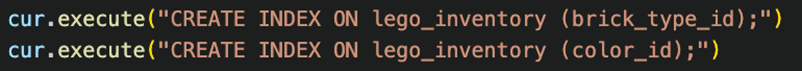

## 1: Database constraints

Tabellen lego_brick kan enten ha en surrogatprimærnøkkel eller en naturlig primærnøkkel, der den naturlige PK består av to mulige kombinasjon av `brick_type_id` og `color_id`. For tabellen lego_inventory gjelder det samme med kombinasjonsnøkkel av `set_id`, `brick_type_id` og `color_id`, men grunnet flere kolonner i primærnøkkelen er det 6 mulige valg for primærnøkkelen. Under er SQl koden for å sette primærnøklene i de to tabellene.

  

Rekkefølgen på primærnøkkelen i lego_brick tabellen gjør at spørringer filtrerer på `brick_type_id` vil kunne dra full nytte av primærnøkkelen og dermed være raskere. Primærnøkkelen til lego_inventory vil gjøre spørringer med joins basert på `set_id` raskere samt spørringer som filtrerer på `set_id`.

  

## 2: Design indexes for flexible queries

For å raskt kunne besvare spørringer om hvilke legosett som inneholder bestemte brikker uavhengig av farge, og motsatt, vil det være en fordel å sette `brick_type_id` eller color_id først i primærnøkkelen. Med en slik rekkefølge på PK vil det være tilstrekkelig å kun lage en indeks for å gjøre disse spørringene raskere. Siden det for senere oppgaver vil være nyttig å ha rask tilgang til set_id for joins mellom tabellene, fremstår rekkefølgen av `set_id`, `brick_type_id` og `color_id` mer naturlig i forhold til dataene. Vi lager derfor indekser for både `brick_type_id` og `color_id` på lego_inventory.

  



  

Ved testing av spørringene før og etter opprettelsen av indekser på lego_inventory-tabellen, og ved bruk av `\timing` on i PostgreSQL, kan vi se at indeksene gir betydelig raskere spørringer. Det er verdt å merke at ved `color_id` = 11 (svart) vil spørringen uten indeks ta kortere tid enn med indekser, henholdsvis 290.732 ms og 583.244 ms. Svart er en populær farge og vil derfor forekommer i mange av radene, derfor var et sekvensielt søk raskere.
  

    SELECT DISTINCT set_id
    
    FROM lego_inventory
    
    WHERE brick_type_id = '3437';


> Uten indeks: 527.405 ms
> Med indeks: 79.855 ms

    SELECT DISTINCT set_id
    
    FROM lego_inventory
    
    WHERE color_id = 251;

  

> Uten indeks: 34.375 ms 
> Med indeks: 7.347 ms


## 3. Algorithmic complexity improvements

I den originale algoritmen tar håndteringen av endepunktet http://localhost:5000/sets omtrent 4,332 sekunder, hovedsakelig grunnet den høye kompleksiteten ved sammensettingen av radstrenger. Kodelinjen `rows = existing_rows + f'<tr><td><a....,`  må  først  kopiere  over  de  eksisterende  radene  før  den  slås  sammen  med  den  nye  raden,  noe  som  gir  denne  linjen  en  kompleksitet  på  O(n^2^).  De  andre  elementene  i  funksjonen  har  lavere  kompleksitet,  dermed  er  den  samlede  kompleksiteten  O(n^2^).  Bare  ved  å  definere  rows  som  er  liste  og  bruke  append  fremfor  konkatinering  av  strenger  tar  håndteringen  bare  115,0  ms  sekunder,  noe  som  senkes  ytterlige  til  50,19  ms  sekunder  når  man  tar  i  bruk  paginering.  Det  er  verdt  å  påpeke  at  de  første  sidene  vil  koste  en  del  mindre  enn  de  siste  sidene  på  grunn  av  offset,  som  betyr  at  databasen  må  lese  alle  radene  den  skal  hoppe  over.

  
  
  

## 4. Encoding, compression, and file handle leaks

Identifiserte flere området i koden der man leste en fil uten å bruke python sin context manager. Endrer derfor fra `template = f.read()` til `with open (…) template = f.read()` slik at python automatisk håndterer lukking av filen.

  

Vi får en Content-length på `2003277` bits når vi har på `UTF-8`, og `4006142` når vi har `UTF-16`. Når vi da kompresser med GZIP så får vi det ned til hele `332499` bits i `UTF-8`, og kun `388341` i `UTF-16`. Vi ser da en reduksjon på omtrent mellom 6 – 10 x i antall bits med GZIP

  
  

## 5. Fileformats

I datasettet har vi en blanding av forskjellig lengde på verdiene. Verdiene som `navn`, `preview_image_url`, `category`, `id` og `brick_type_id` har ikke helt fast lengde imotsetning til `year`, `color_id`, og `count`. På de som har variabel lengde så sender vi først lengden på elementet før selve elementet. Slik at når vi da skal unpacke binærfilen så får vi lengden på hvert element før elementet, og dermed vet hvor stort hvert element er.

  

Men de verdiene som vi vet maksimale lengden på som for eksempel så er den høyeste mulige verdien for `color_id` 255, da trenger vi ikke sende en ekstra byte foran den verdien som skal si lengden på den. Da sender vi 2 bytes når vi kun trenger den ene som faktisk har verdien. count kan også maksimalt representeres i kun 2 bytes, men etter å ha sett igjennom tabellen så kommer høye tall ganske sjeldent, og de fleste tallene er ganske lave. Dermed kan det i teorien representeres i kun 1 byte.


Ved å bruke `count` og `color_id` som et par kan vi utnytte det og sende begge som en byte hver. Vi kan da også utnytte at 255 er en farge som ikke kommer så ofte, og bruke det som et slags kontroll-verdi på at det skal brukes en ekstra byte på count. Da er best case at vi kun bruker 2 bytes totalt for color_id og count og worst case at vi bruker 4. Men i dette datasettet siden majoriteten av verdiene er så lave så vil vi i absolutt fleste tilfeller bruke 2.

  

`brick_type_id` er den verdien som tar opp flest bytes siden den sender alt i `UTF-8`, siden den inneholder tekst og tall så er det vanskelig å håndtere. Men ved å sende det som tall istedenfor `UTF-8` så kan vi spare mye, men da må vi klare å skille mellom det som er kun tall og det som er blandet. Vår løsning sjekker om det er tall som er under 2^16^ 
bit & 2^32^ grensen. Om det er under så kan vi sende det som et rått tall + en kontroll byte i forhånd, istedenfor å bruke en byte per tegn.

Dermed ender vi opp med følgende filformat:

|  | id | name |year|preview_image_url |Category |brick_type_id |color_id|count|*kontroll| 
|--|--|--|--|--|--|--|--|--|--|
| Bytes |  Minst 1 |Minst 1|2|Minst 1|Minst 1|Minst 1|1 |2 & 1| 1|
| Format | Variabel, max 255 bokstaver | Variabel, max 255 bokstaver | >H | Variabel, max 255 bokstaver | Variabel, max 255 bokstaver |Variabel, max 255 bokstaver & >B eller >H|>B| >B & >H| >B |
######    kontroll brukes som signal byte for color_id, count, og brick_type_id sine optimaliseringer.

  
For eksempel for lego-set: `71799-1` i browser får du da respons på ca `187880` bytes mens med vår binær respons får du kun `10053` bytes altså ca 18.5 ganger mindre.


## 6. Frontend and Caching

Vi har valgt å bruke LRU cache for å håndtere lagring av data i minnet. Det er en type cache som fjerner den minst brukte elementet når cachen er full. I dette tilfellet bruker vi det for å lagre de mest nylig brukte legosettene, slik at når en bruker gjør en spørring for et sett som allerede er i cachen, kan vi raskt returnere det uten å måtte hente det fra databasen igjen. LRU har en kompleksitet på O(1) for både innsetting og henting av elementer.

Slik cachen vi lagde fungerer er at den har en størrelse på 100 elementer, og at den sjekker først om set_id er i cachen hvis den er der så bruker den: 

```result = set_cache.pop(set_id)
        set_cache[set_id] = result
```

for å hente ut dataen og samtidig flytte det til toppen av cachen for å indikere at det nylig har blitt brukt. Hvis set_id ikke er i cachen, henter den dataen fra databasen, legger det til i cachen, og hvis cachen er full, fjerner den det minst nylig brukte elementet før den legger til det nye elementet.

Tidene for å hente data fra cachen vs. fra databasen. Velger en vilkårlig set_id = 10497-1 for å teste dette: 

Uten cache = 0.065257s

Med cache = 0.000062s


  
  
  

## 7
